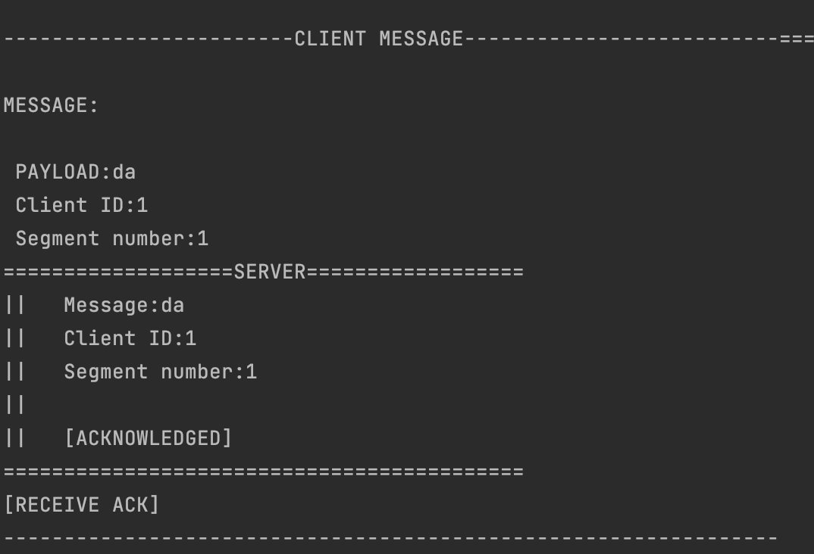
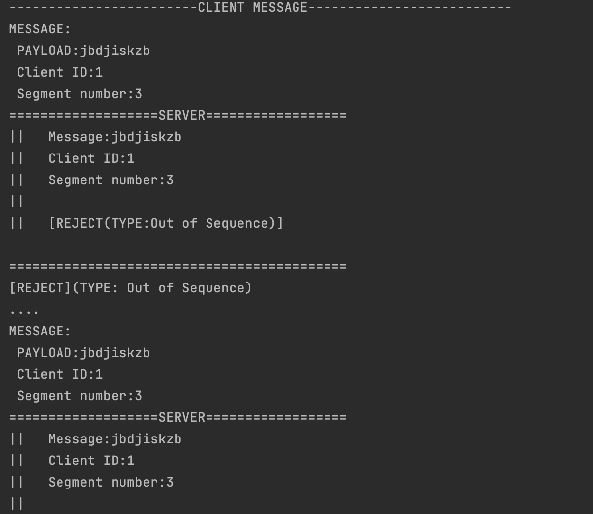
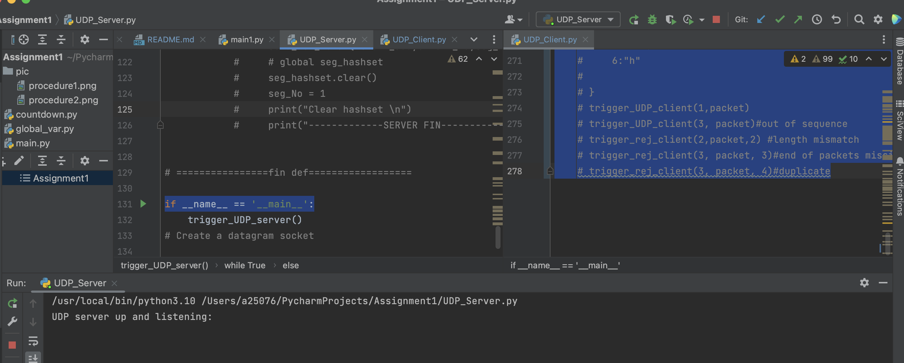
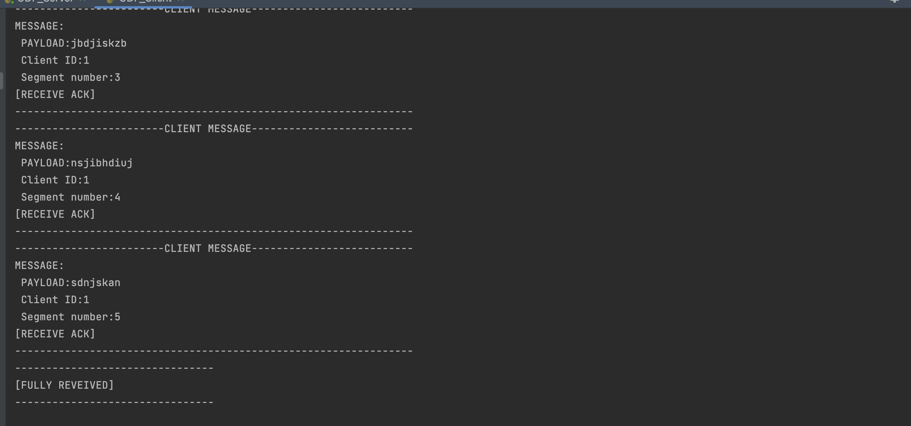
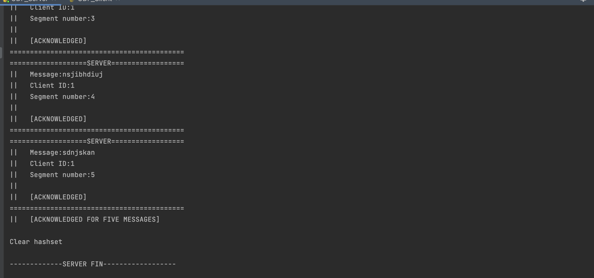
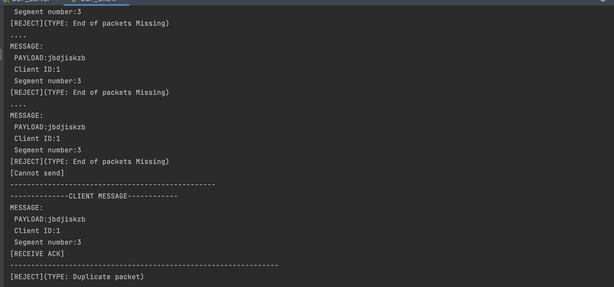
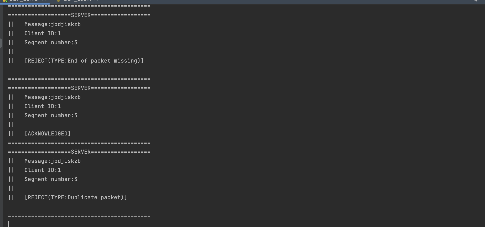
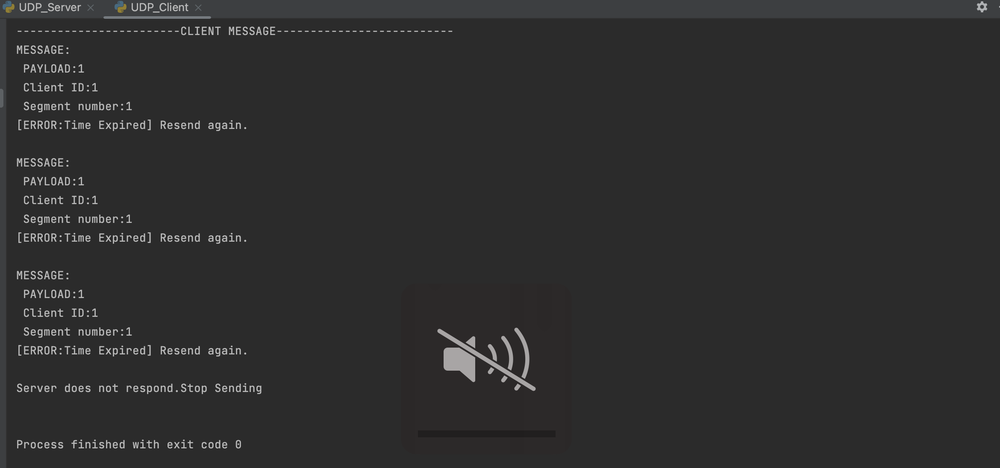

# UDP Protocol-based communication with one client
COEN 233 Computer Networks.

Program assignment 1: 

Client using customized protocol on top of UDP protocol for sending information to the server.

## Installation
Python 3.9.12

## Usage
There are two ways to use the project.
### Combination
If you want to activate the server and client at one time, then you can run main.py for procedure 1 and main1.py for procedure 2 .
The console will return the combinations of the results from client and server. But it is still easy to read.

As you can see, the"------------------------------" represent the client sending message. After that the server response in "==================="block.
Then the client show the received message from server below.

I made these by multiple threads and threading control,which you can see in the main.py and main1.py

The very similar solution to check the reject messages.

Apparently, in this pic, server reject the packet because of 'Out of Sequence'.
So does the client realizes that. It gives a "...." to resend the message again.
When you run the code, you will find that the resend time is three, not infinitely sending.

### Seperated
If you want to observe the output separately from client or server, you can run UDP_client.py. There is an entrance of code within. 
Especially when you want to test Time Expired situation, you can run UDP_client.py only.

To see the results separately, you should let server listening. Run UDP_server.py first. And you will get the output as below.

Note that once you run UDP_server.py, means server will keep listening. That's why we can send messages continuously.

Then run UDP_client.py as the way you want. You may get two types of result as the code I write in the file. One is success. The other is rejection and Error handling.

As you can see. When all pieces are received, the client will receive an additional ACK called [FULLY RECEIVED]. In real world, this means buffer has been cleaned.

Correspondingly, the server will realize and send total ACK back. Due to UDP protocol cannot guarantee in sequence. We may re-order all pieces after by sequence number.
So I design an improvement that the server will send another ack if 5 pieces are successfully receiver.

These two pictures, you can see reject more clear.

(Manually send wrong messages from client,some are resend third times, some just stop resending.)

(Rejection handling in server)

Last part, time stamp:
Every message when sending will be in a try catch block. And if the client buffer does not receive any response from server, it will trigger a TimeOut Exception.
You can test the timeout by exclusively running UDP_client.py, which means the server cannot make any reactions as follows.

## Explanation
### Procedure:

The client sends five packets (Packet 1, 2, 3, 4, 5) to the server.
The server acknowledges with ACK receive of each correct packet from client by sending five ACKs, one ACK for each 5 received packets.

The client then sends another five packets (Packet 1, 2, 3, 4, 5) to the server, emulating one correct packet and four packets with errors.
The server acknowledges with ACK receive of correct packet from client, and with corresponding Reject sub codes for packets with errors. 

The client will start an ack_timer at the time the packet is sent to the server, if the ACK (Acknowledge) for each packet has not been received during ack_timer period by client before expiration of timer then client should retransmit the packet that was sent before.
The timer can be set at 3 seconds (recommended) and a retry counter should be used for resending the packet. If the ACK for the packet does not arrive before the timeout, the client will retransmit the packet and restart the ack_timer, and the ack_timer should be reset for a total of 3 times.
If no ACK was received from the server after resending the same packet 3 times, the client should generate the following message and display on the screen: 
“Server does not respond”.

### Error handling:

NOTE: All four error handling messages below should be simulated and displayed on the screen, the error response messages should be included in a (.pdf, .png, .jpg) file and turned in with your source code.

ACK error handling:
If the ACK timer expires and the ACK from server has not been received by client, an error message should be displayed on the screen by client prior to resending the packet.

Reject error handling with sub code:

Case-1: An error message should be displayed on the screen when the received packet at server is not in sequence with expected packet from client; an error message should be generated by server and sent to client.
	For example, if server receives packets 0, 1 and then 3, packet 3 is out of sequence because the server is expecting the packet 2 after receiving the packet 1. The server will not increment the expected sequence number until packet 2 has been received.

Case-2: The server receives a packet which its length field does not match the length of data in the payload’s field, an error message should be generated by server and send to the client.
	For example, if the length field of a received packet indicates the data payload is 125 bytes, but the actual payload is only 12 bytes, this packet has a length mismatch error.

Case-3: The server receives a packet which does not have the End of Packet Identifier, an error message should be generated by server and send to the client.
	For example, if the last byte of the packet is xFFF0, this packet has a missing end of packet identifier error.

Case-4: The server receives a duplicated packet (sequence number), an error message should be generated by server and send to the client.
	For example, if server receives packets 0, 1 and then packet 1 again, the second packet 1 is a duplicate packet, the server will not increment the expected sequence number.

## License
MIT License

Copyright (c) [2023] [Ningchen Liang]

Permission is hereby granted, free of charge, to any person obtaining a copy
of this software and associated documentation files (the "Software"), to deal
in the Software without restriction, including without limitation the rights
to use, copy, modify, merge, publish, distribute, sublicense, and/or sell
copies of the Software, and to permit persons to whom the Software is
furnished to do so, subject to the following conditions:

The above copyright notice and this permission notice shall be included in all
copies or substantial portions of the Software.

THE SOFTWARE IS PROVIDED "AS IS", WITHOUT WARRANTY OF ANY KIND, EXPRESS OR
IMPLIED, INCLUDING BUT NOT LIMITED TO THE WARRANTIES OF MERCHANTABILITY,
FITNESS FOR A PARTICULAR PURPOSE AND NON INFRINGEMENT. IN NO EVENT SHALL THE
AUTHORS OR COPYRIGHT HOLDERS BE LIABLE FOR ANY CLAIM, DAMAGES OR OTHER
LIABILITY, WHETHER IN AN ACTION OF CONTRACT, TORT OR OTHERWISE, ARISING FROM,
OUT OF OR IN CONNECTION WITH THE SOFTWARE OR THE USE OR OTHER DEALINGS IN THE
SOFTWARE.
## Contact
ningchenliang98@gmail.com
## Acknowledgements
Acknowledgements or thanks to any individuals, organizations, or resources that were helpful or influential in the development of your project.
